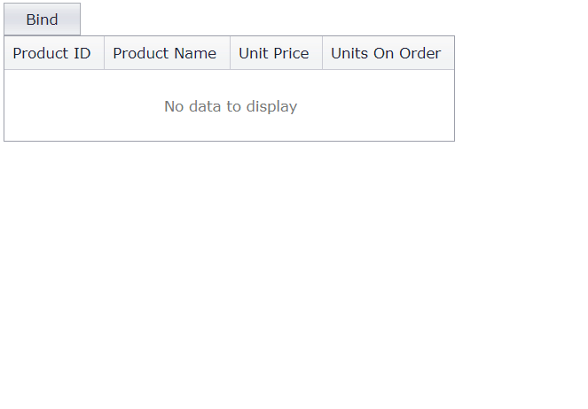

<!-- default badges list -->

[](https://supportcenter.devexpress.com/ticket/details/E4427)
[](https://docs.devexpress.com/GeneralInformation/403183)
<!-- default badges end -->
# Grid View for ASP.NET Web Forms - How to bind the grid to a data source on a button click
<!-- run online -->
**[[Run Online]](https://codecentral.devexpress.com/128537891/)**
<!-- run online end -->

This example demonstrates how to use an external button to bind the grid to a data source.



## Overview

Follow the steps below to bind the grid to a data source:

1. Create the [Grid View](https://docs.devexpress.com/AspNet/DevExpress.Web.ASPxGridView) control and enable its [AutoGenerateColumns](https://docs.devexpress.com/AspNet/DevExpress.Web.ASPxGridView.AutoGenerateColumns) property.

    ```aspx
    <dx:ASPxGridView ID="ASPxGridView1" runat="server" KeyFieldName="ProductID"
        OnDataBinding="ASPxGridView1_DataBinding" AutoGenerateColumns="true" >
        <Columns>
            <!-- ... -->
        </Columns>
    </dx:ASPxGridView>
    ```

2. Add a button and handle its server-side `Click` event. In the handler, save the grid's view state and call the [DataBind](https://docs.devexpress.com/AspNet/DevExpress.Web.ASPxWebControl.DataBind) method.

    ```aspx
    <dx:ASPxButton ID="ASPxButton1" runat="server" Text="Bind" OnClick="ASPxButton1_Click" />
    ```

    ```csharp
    protected void ASPxButton1_Click(object sender, EventArgs e) {
        ViewState["needBind"] = true;
        ASPxGridView1.DataBind();
    }
    ```

3. Handle the grid's server-side `DataBinding` event. In the handler, get the data source and assign it to the grid's [DataSource](https://docs.devexpress.com/AspNet/DevExpress.Web.ASPxDataWebControlBase.DataSource) property.

    ```csharp
    protected void ASPxGridView1_DataBinding(object sender, EventArgs e) {
        if (ViewState["needBind"] != null && (bool)ViewState["needBind"])
            ASPxGridView1.DataSource = Product.GetData();
    }
    ```

> **Note**  
> If the grid is already bound to another data source, set the grid's `EnableViewState` property to `false`.

## Files to Review

* [Data.cs](./CS/WebSite/App_Code/Data.cs) (VB: [Data.vb](./VB/WebSite/App_Code/Data.vb))
* [Default.aspx](./CS/WebSite/Default.aspx) (VB: [Default.aspx](./VB/WebSite/Default.aspx))
* [Default.aspx.cs](./CS/WebSite/Default.aspx.cs) (VB: [Default.aspx.vb](./VB/WebSite/Default.aspx.vb))

## Documentation

* [Bind Grid View to Data](https://docs.devexpress.com/AspNet/3719/components/grid-view/concepts/bind-to-data)
